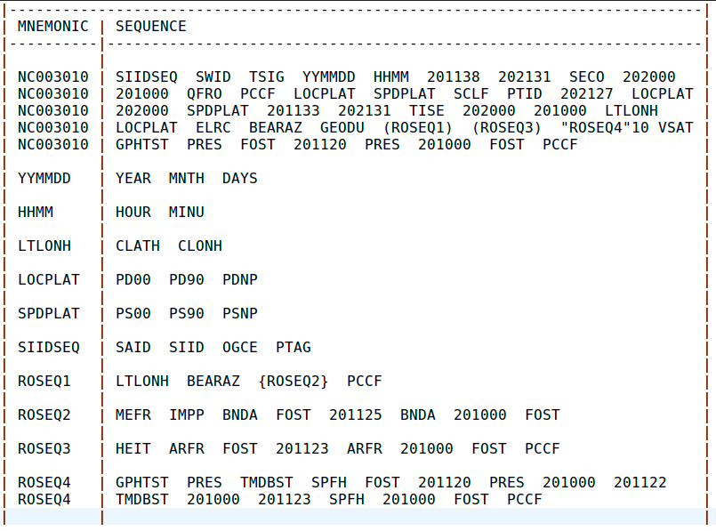

.. _overview:

What is BUFR?
=============

BUFR is a binary format for storing meteorological data. It is used by the World Meteorological
Organization (WMO) and the National Centers for Environmental Prediction (NCEP) to store
observations from weather stations, satellites, and other sources.

You can think of a BUFR file as a collection of messages where each message may originate from the
same or different sources at different times. Each message contains a table and a list data elements
called **subsets**. Each subset is associated with a standard ID like **NC000001**.

Table (Meta Data)
-----------------

The table part of the message describes how the bytes are layed out in the data section for each
subset type (aka. Table A mnemonic). You can think of it like a geographic map. It takes the form of
a tree with nested branches than can be repeated in arbitrary ways. The traditional (NCEPLibs-bufr)
way of illustrating this (generated with the gettab utility) is as follows:

The table shown consists of sequence **mnemonic** in the column on the left, and the contents of
those sequence mnemonics on the right. A **mnemonic** is just a NCEP BUFR string for a particular
type of data element in the BUFR meta data tree. Please note that only particular kinds of
mnemonics are sequence mnemonics (tree elements with children). In the example above the repeated
sequence **ROSEQ1** is associated with children (its a branch), but the mnemonic **MINU** does not
(it is a leaf associated with data values).

The mnemonic **NC003010** is special. It can be thought of as the root or trunk of the tree where
all the other branches are attached. In BUFR it is also known as a **subset**. In general a BUFR
file may have many of these subset nodes, though in this example the file only has 1.

If you look closely at the mnemonics in the table you will notice that some ot the sequence
mnemonics (mnemonics that represent branches) are surrounded by extra characters like **{ }**,
**[ ]**, **( )**. These indicate that that sequence is repeated (replicated) in the data by a number
of times that is defined in the data (known as **delayed replications**). You might also see
something like **" "5** which indicates a sequence that is repeated a fixed number of times
(5 times in this case). These are known as **fixed replications**.

These repeated sequences are also special in that they effectively add dimensionality to the data.
As an example radiance data subsets might have a mnemonic shown as **"BRIT"15** in the table. In
this case you have one dimension associated with the subset (root sequence) where each "observation"
adds a new element in this first dimension, and the **BRIT** sequence adds a second dimension which
is always 15 elements long.

You may sometimes see a sequence mnemonic which is surrounded by the **< >** characters. This
indicates a **binary replication** or sequence that is repeated either 0 or 1 times. These do not
add dimensionality to the data.

Data
----
The data elements in a message subset are associated with the leaf elements (mnemonics) in the
table map described above. They are generally represented as 64 bit values that may encode a
number (integer or float) or an 8 character string.
