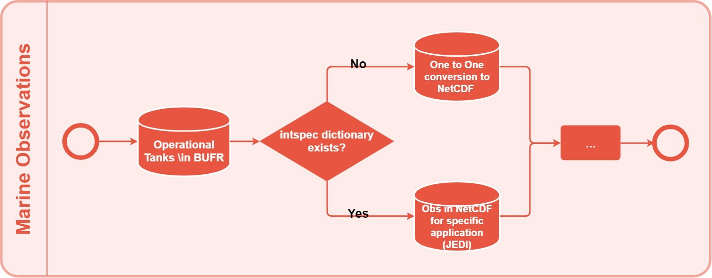

# NCEP data converters.

The ncep_classes.py script in this directory is used to convert (prep-) BUFR data format into IODA (netCDF4) format. The code is based on the bufrlib by NCEP and it has been tested mainly with marine observations. 

### Sample data:

Sample data sets can be retrieved from the operational NCEP's data tanks; and there is a sample (b001/xx007) with the code.

### Required python modules:

numpy, ncepbufr, bufr2ncCommon, bufr2ncObsTypes, netCDF4, argparse, datetime, sys, os, collections and yaml.

### Python version:
The script is compatible with python2 and python3; it is tested with Python 2.7.5 and 3.7.0.

### Usage:
```
$> ncep_classes.py -m  <maximum number of messages to keep (optional)>     \
                   -p  <path with the observations>                        \
                   -i  <name of the input BUFR file>                       \
                   -ot <observation type>                                  \
                   -d  <date in YYYYMMDDHH>                                \
                   -l  <yaml file name>                                    \
                   -o  <output filename in nc (optional)>                  \
                   -Th <thining length (optional, to be removed)>          \
                   -Pr <BUFR or prepBUFR format (optional, to be removed)>

** Maximum number of messages "-m" is optional. If -m is set, the output only contains the first m messages. If -m is not set, the whole bufr file is converted.

** Yaml file "-l" is required. The yaml files for some ncep bufr tanks were already created, and they are named by bufrtank names, e.g., if you are working on b001/xx001, please choose -l NC001001.yaml. These files are located at: lib/pyiodaconv/config

** If user named yaml file does not exist in the lib/pyiodaconv/config directory, a new yaml file will be created in the same lib/pyiodaconv/config directory. User might need to modify their own yaml file to be able to run this program.
  
### Example:

`ncep_classes.py -m 5 -p /path/to/the/datafile/ -i xx007 -ot NC001007 -l NC001007.yaml -d 2020031012`

## Attention:
If the following error shows up:
RuntimeError: NetCDF: String match to name in use
User needs to check their yaml file to see if there are same descriptions for different parameters.
For example, in NC001103.yaml, TPMI and TPHR have same description:
- - time_period_or_displacement
  - TPMI
- - time_period_or_displacement
  - TPHR
You can change the description of TPHR to  - - time_period_or_displacement_2 

```
### Outputs:
The expected outputs are:

* The NetCDF file with the observations: if the name of the output file is not defined, the file name will have the following format: "ioda.ObservationType.YYYYMMDDHH.nc". For the example above, the default output filename is ioda.NC001007.2020031012.nc

* The BUFR table in text format: If it does not exist, the code will generatethe .tbl file with the following name: "ObservationType.tbl", e.g., NC001007.tbl

* The default dictionary containing all the potentially available observations and metadata in the specific observation type: If it does not exist, the code will generate the .dict file with the following name: "ObservationType.dict", e.g., NC001007.dict

* The yaml file: some yaml files are generated and modfied already. The program will generate user named yaml file if user's yaml file does not exist in /config

The structure of a typical yaml file is the following:
```
- - height_of_waves     # netcdf variable name, by default the BUFR description is used with underscores instead of spaces, between the words.
  - HOWV                # BUFR variable name
  - 3                   # Data Types, for more info referring to bufr2ncCommon.py
  - *id001
  - [-1]
```
The users can update the yaml file according to their own naming requirements for the NetCDF variable names, e.g., JEDI requires significant wave height: height_of_waves@ObsValue.

In case that the user provide their own version of yaml, the provided file will be used for the netCDF naming conventions, e.g. CF netCDF naming convention.

High level flowchart of the BUFR to IODA NetCDF converter, and the importance of the dictionary existence:

